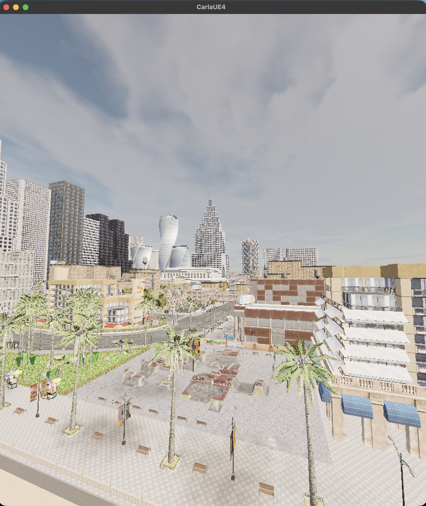

# CARLA 0.9.15 on Apple Silicon

Reproducible notes and Python scripts for the setup tested on this Mac. The Windows CARLA server runs in a [Sikarugir](https://github.com/Sikarugir-App/Sikarugir) Wine wrapper with D3DMetal. The `carla==0.9.15` Python client runs in an amd64 Docker container through Colima and Rosetta. Both sides must use version **0.9.15**.

The 19 GB Wine wrapper and CARLA download are not in this repository. Build them with the steps below.

## Requirements

- Apple Silicon Mac, macOS 15.5 or newer, Homebrew, Rosetta 2
- Around 30 GB free disk space; 24 GB RAM recommended

Install Rosetta if needed:

```sh
softwareupdate --install-rosetta --agree-to-license
```

## 1. Install the server

```sh
brew tap sikarugir-app/sikarugir
brew install --cask sikarugir-app/sikarugir/sikarugir
mkdir -p ~/CARLA/CARLA_0.9.15
curl -L -C - -o ~/CARLA/CARLA_0.9.15.zip \
  https://downloads.carlasim.com/Windows/CARLA_0.9.15.zip
unzip -t ~/CARLA/CARLA_0.9.15.zip
unzip -q ~/CARLA/CARLA_0.9.15.zip -d ~/CARLA/CARLA_0.9.15
open -a 'Sikarugir Creator'
```

The download URL is from [CARLA's 0.9.15 release](https://github.com/carla-simulator/carla/releases/tag/0.9.15). The older `tiny.carla.org` link in the original guide no longer worked during this setup.

In Sikarugir Creator:

1. Install engine `WS12WineCX24.0.7_7` and update the wrapper template if prompted.
2. Create an empty app named `CARLA.app` in `~/Applications/Sikarugir/`. Skip Gecko and Mono if prompted.
3. Open `~/Applications/Sikarugir/CARLA.app`, click **Winetricks**, install `vcrun2019`, and close Winetricks.
4. Click **Install Software** → **Move a Folder Inside**. Choose `~/CARLA/CARLA_0.9.15/WindowsNoEditor`. Choose `CarlaUE4.exe` as the executable. Moving the folder removes it from the extraction directory.
5. Confirm **Windows app** is `"C:\Program Files\WindowsNoEditor\CarlaUE4.exe" -quality-level=Low`.
6. Check **D3DMetal**. Leave DXMT and DXVK unchecked. Click **Test Run** and allow a few minutes for the first launch.

The CARLA town should appear. Keep that window open while using the client. Check the server port with:

```sh
lsof -nP -iTCP:2000 -sTCP:LISTEN
```

## 2. Install the client

```sh
brew install colima docker
colima start --vm-type vz --vz-rosetta --cpu 4 --memory 8
git clone https://github.com/goodwiins/carla-macos-setup.git ~/CARLA/client
~/CARLA/client/run.sh
```

On this Mac, `~/CARLA/client` already contains this repository, so cloning is unnecessary. The first `run.sh` builds the image. With CARLA running, the smoke test prints matching client/server versions and ends with `Round-trip OK`.

## Daily use

```sh
open ~/Applications/Sikarugir/CARLA.app
colima status || colima start
lsof -nP -iTCP:2000 -sTCP:LISTEN  # wait for a listener before running a client
~/CARLA/client/run.sh
~/CARLA/client/run.sh python watch_drive.py
~/CARLA/client/run.sh python replay_drive.py
```

`watch_drive.py` follows an autopilot vehicle for 60 seconds and saves a CARLA recorder `.log` **inside the server wrapper**. That log is simulation data, not video. `replay_drive.py` replays it in the CARLA window. Stop the server by closing CARLA; `colima stop` is optional.

If the client times out, confirm the CARLA town is still open and port 2000 is listening, then retry. The smoke test succeeded here with client/server `0.9.15` and Town10HD. `watch_drive.py` completed a 60-second run; its tick-synced camera also passed a 10-second run. `replay_drive.py` has not been tested end to end.

## Screenshots

These captures from this Mac show the [Sikarugir configuration](screenshots/carla-sikarugir-setup.png) and [CARLA running](screenshots/carla-running-macos.png).



## Agent skill

Agents working in this repository can follow [AGENTS.md](AGENTS.md). To use the bundled skill from any Codex task, install it once from this checkout:

```sh
cd ~/CARLA/client
mkdir -p ~/.codex/skills
ln -s "$PWD/skills/carla-macos" ~/.codex/skills/carla-macos
```

Start a new Codex task and ask for `$carla-macos` to install, run, or troubleshoot this setup. The skill provides instructions; it does not install CARLA until asked.

Based on [Nathan Friend's article](https://nathanfriend.com/2026/07/17/carla-on-macos-with-fable.html) and [Fable's setup guide](https://gitlab.com/-/snippets/6006738/raw). This repository captures the Docker-client path used here; the article also links to later native-client work.
